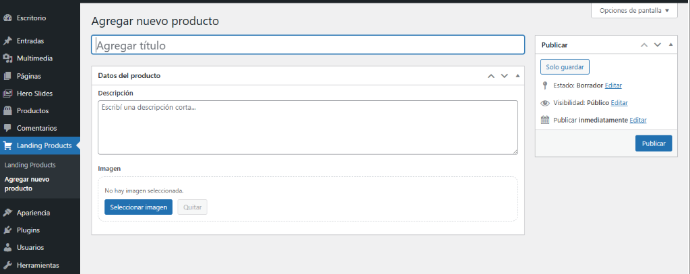
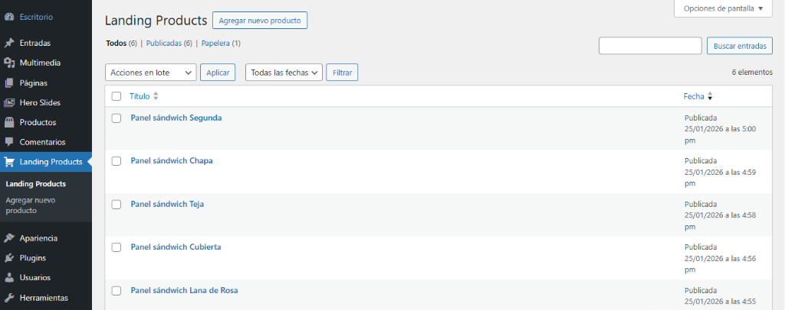
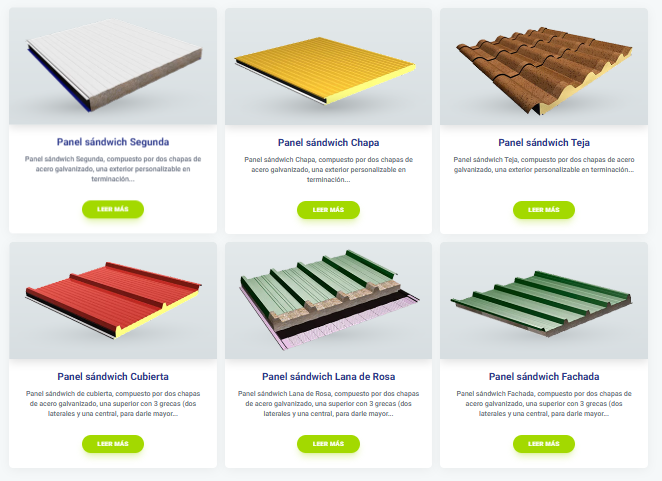

# LP Products (Metabox)

Un plugin ligero y potente para gestionar y mostrar productos de forma elegante en tu sitio web de WordPress, diseñado específicamente para Landing Pages.

## ✨ Características

- **Gestión Intuitiva**: Menú personalizado en el admin llamado "Landing Products".
- **Metabox Personalizado**: Carga fácilmente el título, descripción e imagen de cada producto.
- **Visualización Responsive**: Grid adaptable que se ve perfecto en móviles, tablets y escritorio.
- **Basado en Shortcodes**: Muestra tus productos en cualquier página o entrada con total flexibilidad.

## 🚀 Instalación

1. **Subir**: Copia la carpeta `lp-products` en el directorio `/wp-content/plugins/` de tu instalación de WordPress.
2. **Activar**: Ve a la sección de **Plugins** en tu panel de administración y busca "LP Products (Metabox)". Haz clic en **Activar**.
3. **Configurar**: Verás un nuevo menú llamado **Landing Products** en la barra lateral izquierda.

## 📋 Uso y Configuración

### 1. Cargar Productos
Ve a **Landing Products > Agregar nuevo producto**. Ingresa el título, la descripción y selecciona la imagen que prefieras.

### 2. Gestionar
Puedes ver y editar todos tus productos desde el listado general.

### 3. Mostrar en la Web
Usa el shortcode `[lp_products]` en cualquier parte de tu contenido.

#### Parámetros Personalizables:
- `limit`: Cantidad de productos a mostrar (Por defecto: 12).
- `cols`: Número de columnas en escritorio (Por defecto: 3, Máximo: 6).

**Ejemplo de uso:**
`[lp_products limit="6" cols="3"]`

## 🎨 Resultado Final
Los productos se visualizarán con un diseño moderno y tarjetas limpias que incluyen efectos de hover.

---
*Desarrollado para Landing Pages de Alto Rendimiento.*
